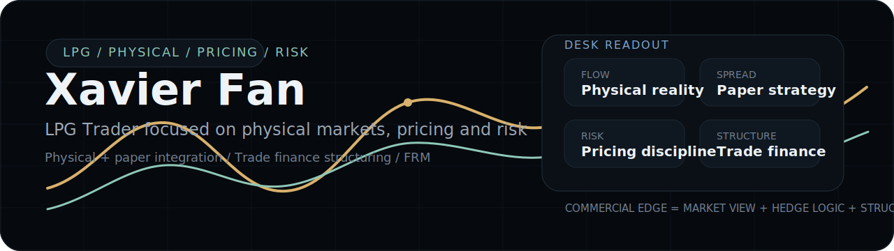

  

**LPG Trader focused on physical markets, pricing and risk**

> Commercial edge lives where physical flow, paper strategy, and trade finance structure support the same objective.

My background in petrochemical risk control, FRM training, and experience across Fortune Global 500 platforms shape how I think about market structure, exposure discipline, and execution quality.

`LPG` `FRM` `Physical + Paper` `Pricing & Risk` `Trade Finance`

### Trading Edge

- Anchor decisions in logistics, basis, pricing terms, and execution constraints.
- Translate commercial exposure into cleaner hedge logic and sharper risk transfer.
- Treat trade finance as part of commercial architecture, not a downstream process.

### Selected Work

- **[oil-trading-system](https://github.com/Xavier-Fan123/oil-trading-system)**  
  A trading platform built around workflow discipline, settlement logic, position visibility, and risk-aware system design.

- **[lpg-trading-knowledge-base](https://github.com/Xavier-Fan123/lpg-trading-knowledge-base)**  
  A structured LPG research system covering market fundamentals, logistics, benchmarks, and trading workflows.

### Background

- **Financial Risk Manager (FRM)**
- **Xiamen University** - B.A. in Economics, School of Economics
- **Singapore Management University** - M.Sc. in Financial Economics

### Contact

[LinkedIn](https://www.linkedin.com/in/zhangxuan-fan-23a88a245) | [Site](https://xavier-fan123.github.io) | [Email](mailto:fanzhangxuan@outlook.com)